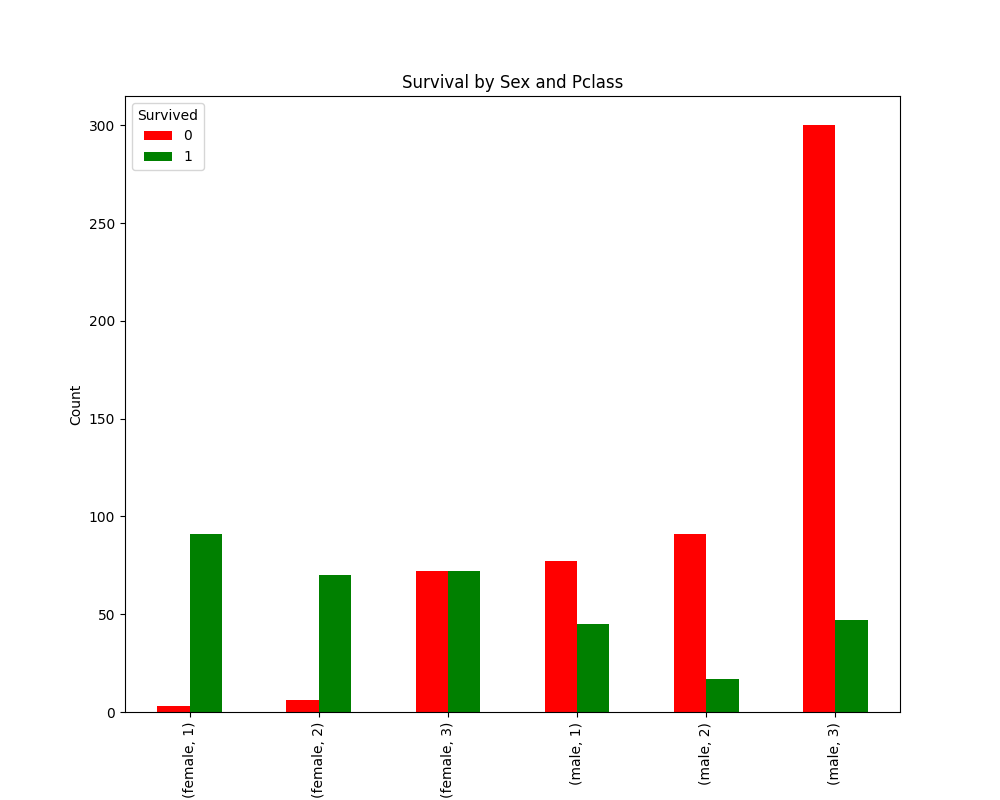

# 🚢 Titanic Dataset Analysis

This project analyzes the famous Titanic dataset to discover the factors that influenced the survival rates of the passengers.

## 📂 Project Overview

In this analysis, I used Python to process the raw data and uncover meaningful insights.

### 1. Data Cleaning
- **Missing Values:** Filled missing values in `Age` with median and `Embarked` with mode.
- **Dropping:** Removed the `Cabin` column due to excessive missing data.

### 2. Feature Engineering
- **FamilySize:** Combined `SibSp` and `Parch`.
- **IsAlone:** Indicates whether a passenger was traveling alone.
- **AgeGroup:** Categorized passengers into groups (Child, Teenager, Young Adult, Adult, Senior).

## 📊 Key Insights & Visualizations
Based on the analysis, here are the key findings:

- **Gender Distribution:** There were mostly men rather than women on the Titanic. Unfortunately, the majority of male passengers did not survive.
- **Average Age:** The average age of the passengers was 29.
- **Women First:** Genders show drastically different survival rates. Women had a **significantly higher chance** of survival compared to men, clearly showing the "Women and children first" policy was strongly enforced.
- **Family Matters:**
    - **Passengers with family:** 50.6% survival rate.
    - **Passengers alone:** 30.4% survival rate.
- **Economic Status:** Pclass 3 passengers had the highest death rate. Moreover, the graphs show that **Poor Men** (3rd Class Males) had the highest death rate.

## 🛠 Technologies Used 
- Python
- Pandas (For data manipulation)
- Matplotlib and Seaborn (For data visualization)
- Jupyter Notebook (For interactive coding and documentation)